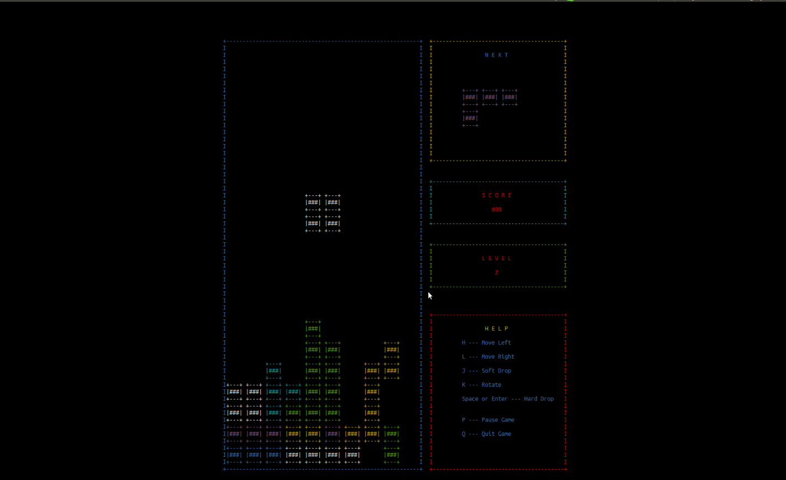
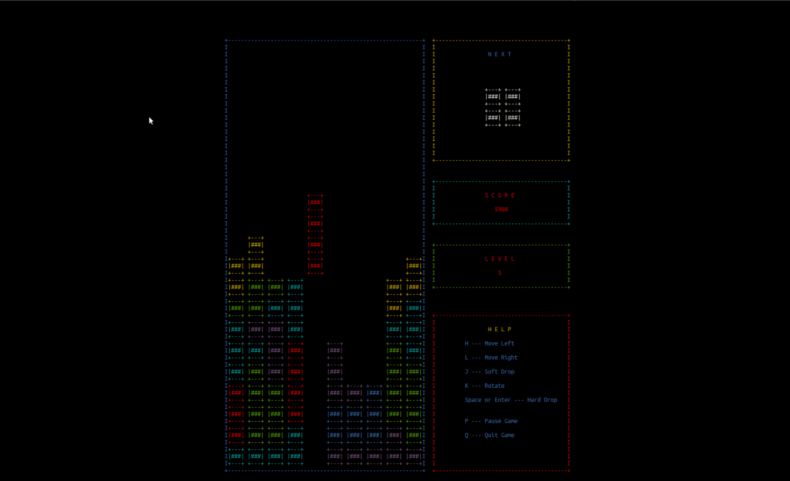
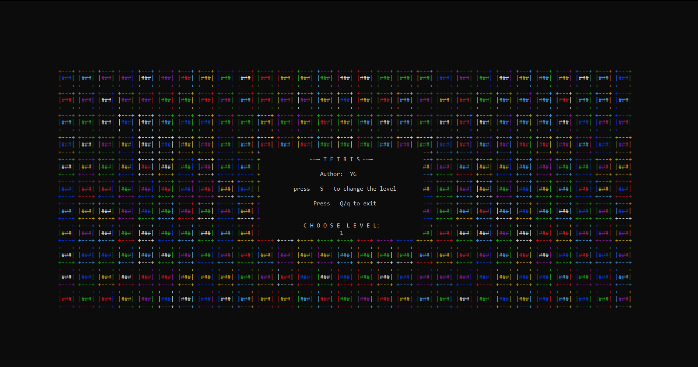
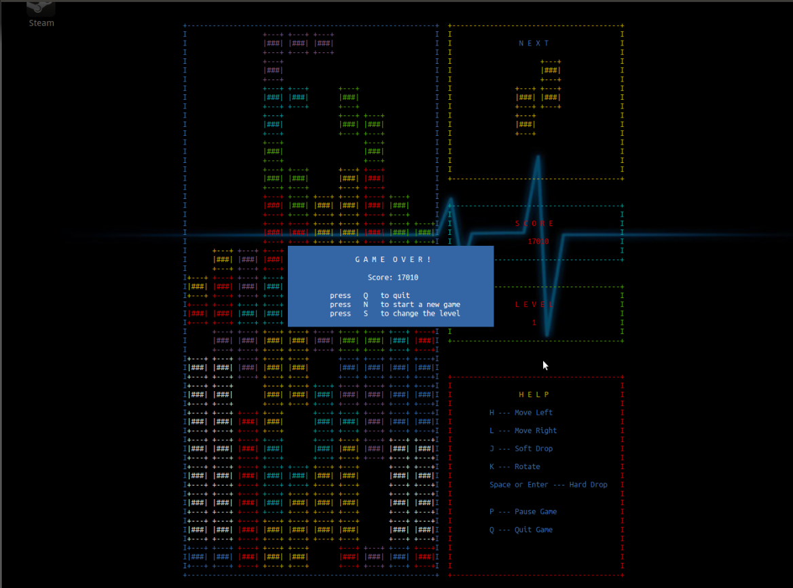
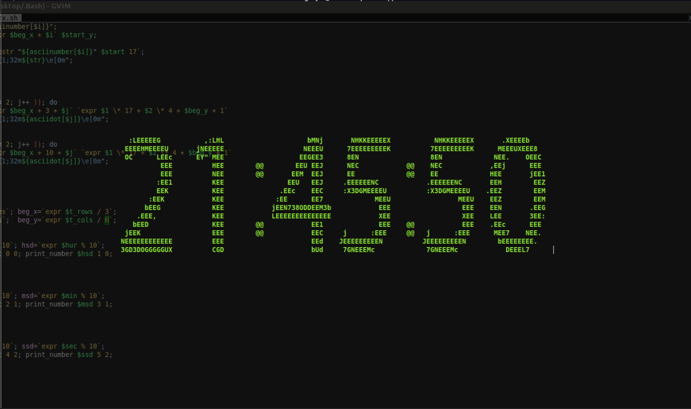
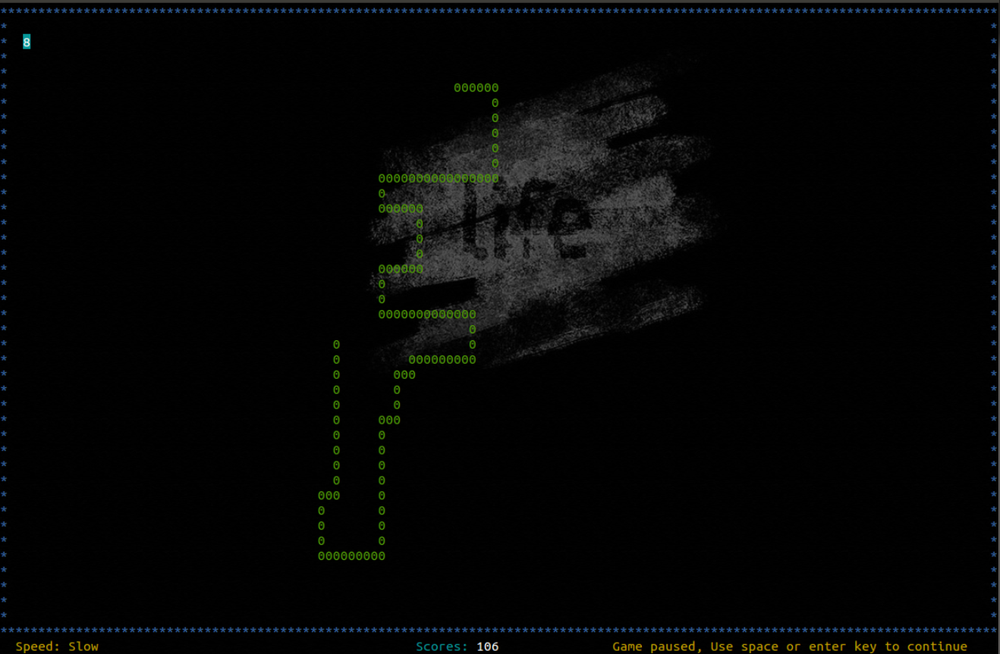
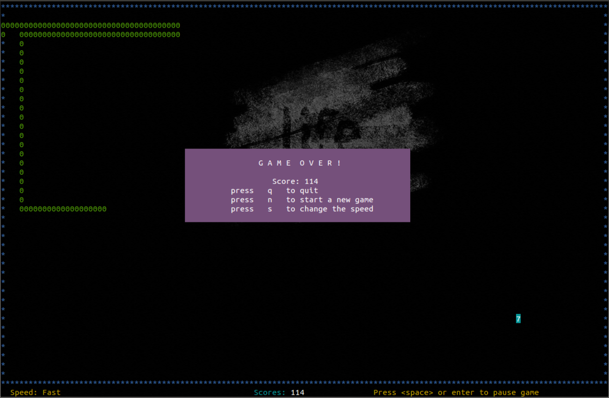

Terminal Games
===========
Linux终端下的小游戏，和小东西，包括 俄罗斯方块，贪吃蛇，屏保时钟，翻译脚本。。。
所有的方向按键都是按照 vim ‘hjkl’ 来的！

俄罗斯方块 (Tetris)
===================
看起来是不是很棒 :D, 有 0 - 9 级， 最后结束了，还能支持游戏回放功能哦。。。

数字时钟 (Clock)
================

贪吃蛇 (Snake)
=================
这个贪吃蛇不怎么好看。。。
######
######
  
